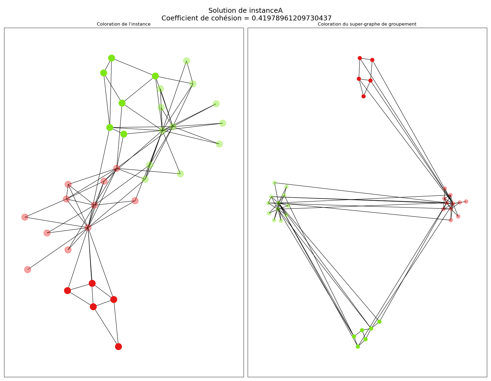
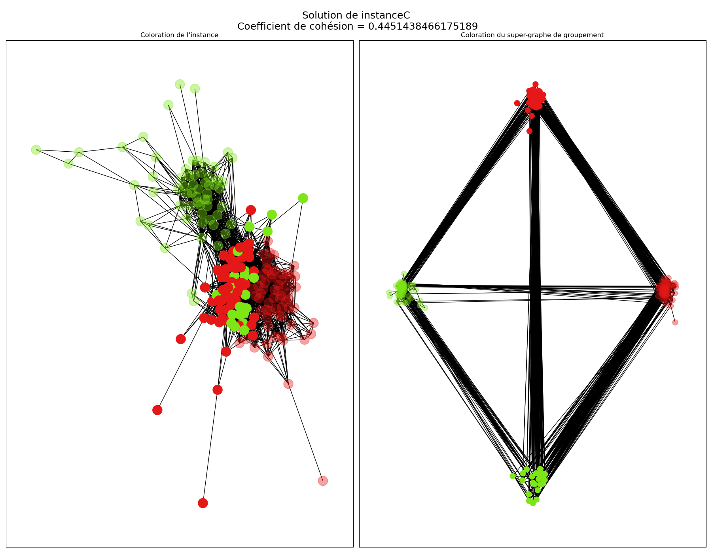

# Polytechnique Montréal - INF6102 : Graph Community Clustering 

Given social network data from various regions, each represented as an undirected graph where nodes are individuals and edges indicate social relationships, the task is to partition each graph into cohesive groups of individuals (clusters) in order to maximize the modularity metric.

You can find two solvers :
* random : solver_random.py : a random solver.
* advanced : solver_advanced.py : an advanced implementation, full documentation in the Report PDF.

You can find a clear description of what was expected and how to run in the Assignement PDF and a succint report of my implementation in the Report PDF (both in french).

## How to run

To run a solver on an instance :
```console
$ python main.py --agent=(agent-name).py --infile=./instances/(instance-name).txt
```

## Visualization

Visualization of a solution for the instance A :


Visualization of a solution for the instance C :


Visualization of a solution for the instance I :

